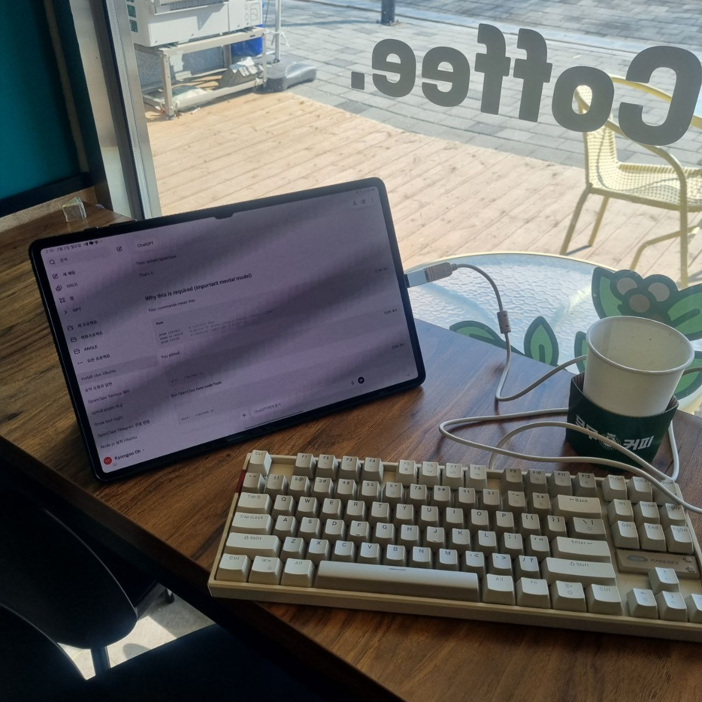

# 2026-02-02 — 카페에서 블로그 세팅

오늘 카페에서 GitHub Pages 블로그를 만들었다.

Claude Code(Claudegram)한테 시키니까 금방이었다. 블로그 타이틀도 처음엔 "KJ's Blog"였는데 별로라서 "Kyongjoo's Blog"로 바꿨다.

그리고 이 일기장도 만들었다. 나만 볼 수 있게 추측 어려운 경로로 숨겨뒀다. 검색엔진도 차단해둠.

태블릿에 기계식 키보드 연결해서 작업했는데, 카페에서 이렇게 하니까 나름 괜찮다.

[← 목록으로](../)
