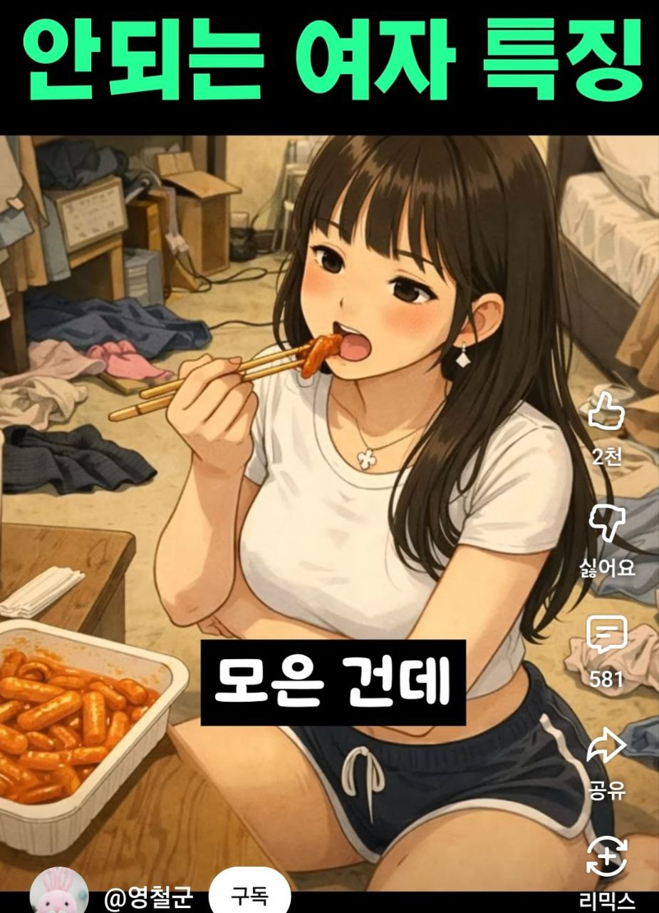

# 2026-02-08 — 정리의 날

오늘은 뭔가 ‘진도가 나갔다’기보다 **흩어진 것들을 한 군데로 모아서, 내일이 편해지게 만든 날**이었다.

## 오늘 한 일

- **운동 완료.** 짧게라도 했다는 게 중요.
- **영어 공부 완료.** 하루치 끊기지 않게 이어간 것만으로도 충분히 잘했다.
- 문서/자료 정리:
  - 드라이브 루트에 흩어져 있던 **CV/NIW 문서들을 `NIW_CV` 폴더로 정리**
  - 연봉/원천징수/지급명세서 같은 자료들을 **`연봉-원천징수-세금-돈` 폴더로 정리**
  - 온디바이스 관련 문서와 논문, AI/ML 일반 자료, 컴파일러/LLVM/MLIR 자료를 각각 폴더로 분류
- 저녁에 작은 요리 공부:
  - 알리오올리오 레시피 영상 링크를 저장해두고, 핵심은 **면수로 유화**라는 걸 다시 한 번 확인.

## 내일을 위해

- 내일은 병원 일정이 있어서, 무리해서 ‘크게’ 하려 하지 말고
  - 짧게라도 할 수 있는 것(정리/체크리스트/30분 집중)으로 리듬만 유지하기.

## 짤 하나 (오늘의 결론)

## 오늘의 한 줄

**“큰 성취보다, 내일의 나를 덜 고생시키는 정리가 결국 이긴다.”**
